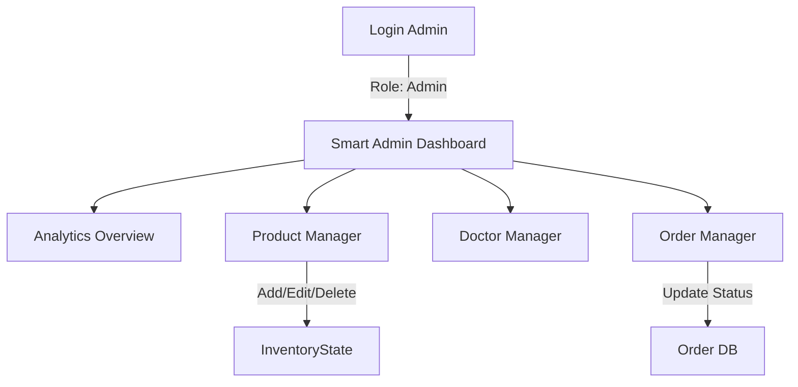

# 🏗️ ArogyaSagar - Architecture & Flow Documentation

This document outlines the updated dynamic architecture, role-based flows, and intelligent modules of the ArogyaSagar platform.

---

## 1️⃣ System Architecture (Dynamic Context)

```mermaid
graph TD
    subgraph Client_App
        Browser[User/Admin Browser]
        ReactContext[Global App Context (State Manager)]
    end

    subgraph Core_Modules
        AuthMod[Auth & Role Service]
        InvMod[Inventory Management]
        OrderMod[Order Processing Engine]
        RecMod[Recommendation Engine]
    end

    subgraph Data_Persistence
        LocalStorage[Browser Local Storage]
        AI_API[Gemini AI Service]
    end

    Browser --> ReactContext
    ReactContext --> AuthMod
    ReactContext --> InvMod
    ReactContext --> OrderMod
    ReactContext --> RecMod
    
    ReactContext <-->|Persist/Hydrate| LocalStorage
    ReactContext <-->|Chat Queries| AI_API
```

---

## 2️⃣ User Flows by Role

### A. Customer Journey
```mermaid
graph LR
    Login[Login] -->|Role: User| Profile[User Dashboard]
    Profile --> Edit[Edit Details]
    Profile --> History[View Orders]
    
    Browse[Shop] -->|View Product| RecEngine[Track Interest]
    RecEngine -->|Update Score| Recommendations[Show 'Recommended For You']
    
    Cart --> Checkout -->|Place Order| OrderMod[Create Order (Processing)]
```

### B. Admin Workflow


---

## 3️⃣ Recommendation Logic
The recommendation engine works on a **Category Affinity Score**.

1.  **Tracking**: Every time a user views a product or adds it to the wishlist, the system increments a counter for that product's category in the user's `viewHistory`.
2.  **Scoring**: `Score = (Category Views)`
3.  **Suggestion**: The shop page sorts categories by score and fetches top-rated products from the highest-scoring category.
4.  **Fallback**: If no history exists, it shows "Trending" (High rated products).

---

## 4️⃣ Backend Integration (Future State)
Currently, the `AppContext` simulates a backend. To migrate to a real backend:
1.  Replace `useState` hooks in AppContext with `axios` calls to API endpoints.
2.  Move `PRODUCTS` and `DOCTORS` data to a PostgreSQL database.
3.  Implement JWT validation in `SpringBoot`.
